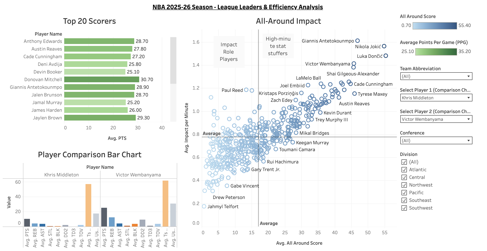
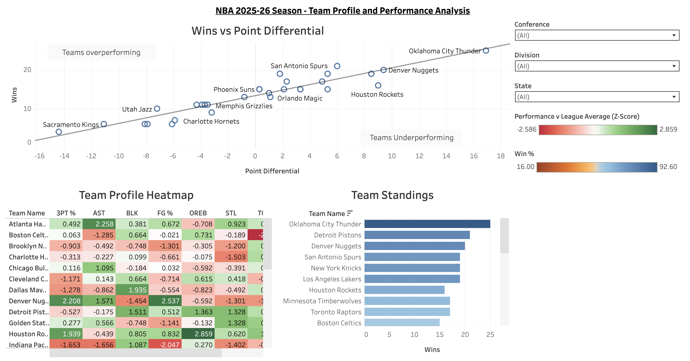
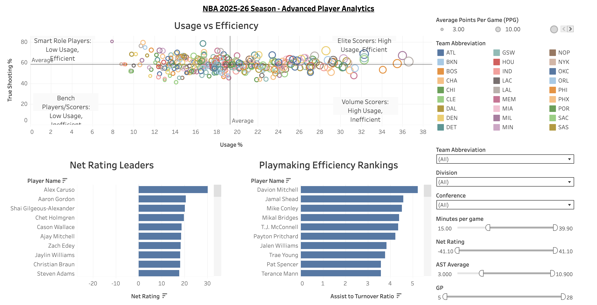

# NBA-Player-Performance-Dashboard

## 🏀 Project Overview
Interactive Tableau dashboard analyzing NBA player statistics, team performance, and advanced analytics for the 2025-26 NBA Regular season.

## 🔗 Live Dashboard
**[View Interactive Dashboard →](https://public.tableau.com/views/NBAPlayerPerformanceDashboard_17662767288290/LeagueOverview?:language=en-US&:sid=&:redirect=auth&:display_count=n&:origin=viz_share_link)**

*Best viewed on desktop. Navigate through three comprehensive dashboards exploring player stats, team performance, and advanced analytics.*

## 📊 Dashboard Pages

### 1. League Leaders & Efficiency Analysis
Explore top scorers, all-around impact players, and player-to-player comparisons.

**Key Features:**
- Top 20 scoring leaders with interactive filtering
- All-Around Impact bubble chart identifying multi-dimensional players
- Player comparison tool with customizable stat selection
- Conference and division filtering

### 2. Team Profile and Performance Analysis
Comprehensive team-level analytics showing standings, performance metrics, and comparative analysis.

**Key Features:**
- Wins vs Point Differential scatter plot with trend analysis
- Team Profile Heatmap comparing all teams strengths and weaknesses across key statistics
- Interactive team standings with win percentage tracking
- Conference, division, and state filtering

### 3. Advanced Player Analytics
Deep dive into efficiency metrics, usage rates, and advanced basketball analytics.

**Key Features:**
- Usage Rate vs True Shooting % scatter plot with quadrant analysis
- Net Rating leaders identifying most impactful players
- Playmaking efficiency rankings (Assist-to-Turnover ratio)
- Adjustable filters for minutes, games played, and performance thresholds

## 💡 Key Insights

### Elite Scorer Identification
**Finding:** Players in the top-right quadrant of the Usage vs Efficiency chart (high usage rate >25% + high true shooting % >58%) represent the league's most valuable offensive weapons.

**Current Elite Scorers:** Giannis Antetokounmpo, Nikola Jokic, Shai Gilgeous-Alexander, and Luka Doncic combine high-volume scoring with exceptional efficiency, making them MVP candidates.

### All-Around Impact Leaders
**Finding:** Players averaging 1.2+ impact per minute across all five major statistical categories (PTS, REB, AST, STL, BLK) while playing 30+ minutes are the true superstars.

**Insight:** Nikola Jokic leads with the highest all-around score (55+), demonstrating production across all facets of the game-not just scoring.

### Team Performance Correlation
**Finding:** Teams in the "overperforming" quadrant (high wins relative to point differential) often rely on strong clutch performance or defensive prowess not captured in basic metrics.

**Example:** Oklahoma City Thunder leads with both high win total and strong point differential (+18), indicating sustainable success.

### Playmaking Efficiency
**Finding:** Players with 4.0+ assist-to-turnover ratio while maintaining 5+ assists per game represent elite decision-making.

**Insight:** Point guards who protect the ball while facilitating at high volume are increasingly valuable in modern NBA offenses.

## 🛠️ Tools & Technologies

### Data Collection & Processing
- **Python 3.x** - Data collection and cleaning
- **nba_api** - Official NBA Stats API wrapper
- **Pandas** - Data manipulation and transformation
- **NumPy** - Numerical computations

### Visualization & Analysis
- **Tableau Public** - Interactive dashboard creation
- **Advanced Analytics** - True Shooting %, Usage Rate, Net Rating, PER
- **Statistical Methods** - Z-scores, percentile rankings, correlation analysis

### Version Control
- **Git/GitHub** - Version control and documentation
- **Markdown** - Project documentation

## 📁 Project Structure
```
nba-player-performance-dashboard/
│
├── README.md
├── data/
│   ├── raw/                          # Original API data
│   │   ├── player_stats.csv
│   │   ├── team_stats.csv
│   │   ├── advanced_player_stats.csv
│   │   ├── all_players_info.csv
│   │   └── all_teams_info.csv
│   └── processed/                    # Cleaned data
│       ├── player_stats_clean.csv
│       ├── team_stats_clean.csv
│       ├── all_players_info_clean.csv
│       └── all_teams_info_clean.csv
│
├── scripts/
│   ├── data-collection.py           # Data collection from NBA API
│   ├── data-cleaning.py             # Data cleaning and transformation
│   ├── data-exploration.py          # Data exploration
│   └── requirements.txt             # Python dependencies
│
├── documentation/
│   ├── data_dictionary.md           # Complete data field documentation
│   └── tableau_calculations.md      # Calculated fields and formulas
│
└── images/
    ├── league_overview.png
    ├── team_performance.png
    └── advanced_analytics.png
```

## 🚀 How to Reproduce This Project

### Step 1: Clone the Repository
```bash
git clone https://github.com/YOUR_USERNAME/nba-player-performance-dashboard.git
cd nba-player-performance-dashboard
```

### Step 2: Set Up Python Environment
```bash
# Create virtual environment
python -m venv venv

# Activate virtual environment
# On Mac/Linux:
source venv/bin/activate
# On Windows:
venv\Scripts\activate

# Install dependencies
pip install -r scripts/requirements.txt
```

### Step 3: Collect Data
```bash
python scripts/data-collection.py
```

This will create 5 CSV files in `data/raw/` with current NBA season data.

### Step 4: Clean Data
```bash
python scripts/data-cleaning.py
```

This processes the raw data and creates cleaned versions in `data/processed/`.

### Step 5: Open in Tableau
1. Open Tableau Public
2. Connect to the CSV files in `data/processed/`
3. Build visualizations following the documentation in `documentation/tableau_calculations.md`

## 📸 Dashboard Previews

### League Overview

*Top scorers, all-around impact analysis, and player comparison tool*

### Team Performance

*Team standings, win correlation analysis, and team profile heatmap (strengths and weaknesses)*

### Advanced Analytics

*Usage vs efficiency quadrant analysis, net rating leaders, and playmaking rankings*

## 📊 Data Sources

- **Primary Source**: [NBA Stats API](https://www.nba.com/stats) (stats.nba.com)
- **Season**: 2025-26 NBA Regular Season
- **Update Frequency**: Data collected December 2025
- **Data Quality**: 
  - Filtered to players with 5+ games played
  - Cleaned missing values and outliers
  - Validated against official NBA sources

## 🎯 Skills Demonstrated

### Technical Skills
- **Data Engineering**: API integration, ETL pipeline development, data cleaning
- **Programming**: Python (Pandas, NumPy, API requests)
- **Data Visualization**: Tableau (parameters, calculated fields, dashboard design)
- **Statistical Analysis**: Advanced metrics calculation, correlation analysis
- **Version Control**: Git workflow

### Analytical Skills
- **Domain Expertise**: Basketball analytics, advanced metrics interpretation
- **Problem Solving**: Handling missing data, outlier detection, metric normalization
- **Data Storytelling**: Dashboard narrative design, insight extraction
- **Critical Thinking**: Metric selection, visualization choice justification

### Soft Skills
- **Communication**: Clear documentation, visual design principles
- **Attention to Detail**: Data validation, consistent formatting
- **Project Management**: Structured workflow, iterative development

## 📈 Future Enhancements

**1. Adding Player Positional Data**
- Integrating player positions (e.g., Guard, Forward, Center) will enable:
- Position-based comparisons
- Role-specific performance metrics
- Filtering dashboards by positional groups

**2. Incorporating Biographical & Demographical Attributes**
- Enhance player/team profiles by adding key physical and background information, such as:
- Height, weight, wingspan
- Vertical leap and athletic measurements
- Age, hometown, and nationality
- College or previous playing experience
- Additional geographical data to plot on maps

**3. Adding Historical / Previous Season Data**
- Including prior-season statistics will allow:
- Year-over-year trend analysis
- Player development tracking
- Momentum insights for predictive modeling

## 📚 Additional Documentation

- **[Data Dictionary](documentation/data_dictionary.md)** - Complete field definitions and data sources
- **[Tableau Calculations](documentation/tableau_calculations.md)** - All calculated fields and formulas

## 📄 License

This project is licensed under the MIT License - see the LICENSE file for details
---
*Last Updated: 12/21/2025*
